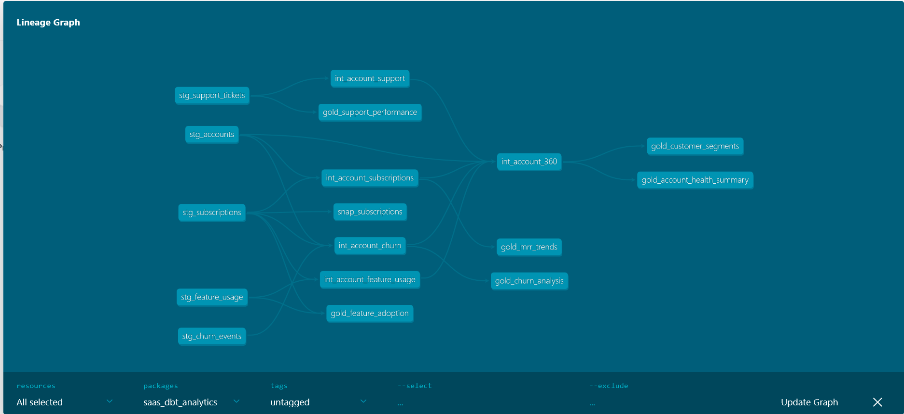
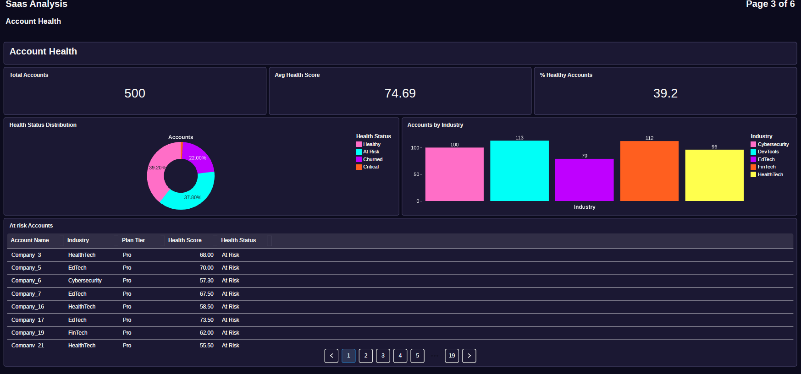
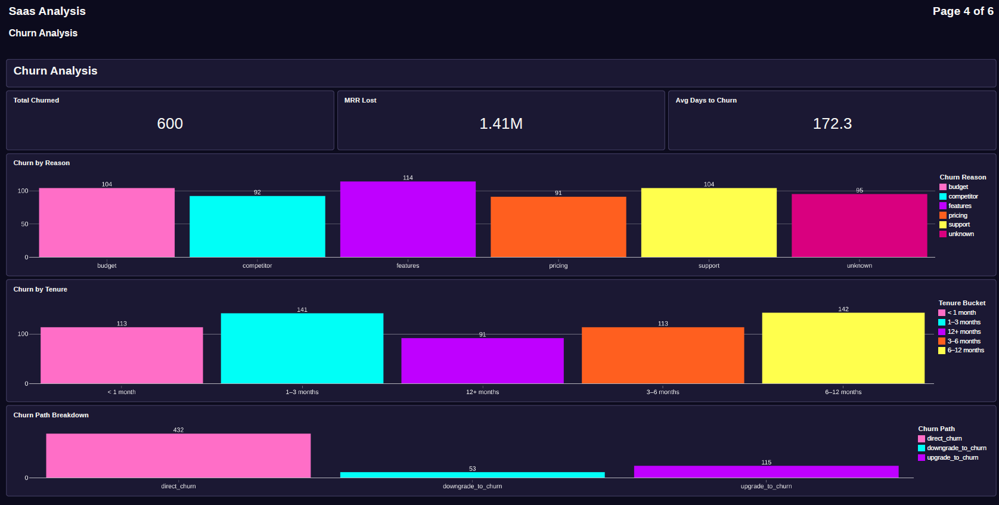
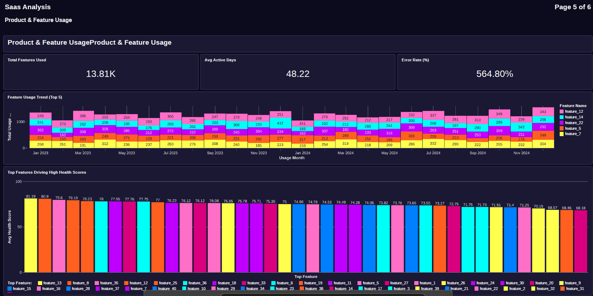

# SaaS Analytics Engineering Project (Databricks + dbt)


>End-to-end Analytics Engineering pipeline for a SaaS dataset built using Databricks and dbt.

> Raw CSVs in — Delta bronze tables, dbt-transformed gold models, and a live Databricks dashboard out.

<br>

## Stats

| Models | Tests | Layers | Domains | Snapshots | Macros |
|:---:|:---:|:---:|:---:|:---:|:---:|
| 16 | 32 | 4 | 5 | 1 | 1 |

<br>

---

## Architecture

```
┌──────────────────────────────────────────────────────────────┐
│                        CSV FILES                             │
│          (uploaded to Databricks Volume)                     │
└───────────────────────────┬──────────────────────────────────┘
                            │  PySpark notebook
                            ▼
┌──────────────────────────────────────────────────────────────┐
│  🟤  BRONZE  ·  Databricks Delta Tables                      │
│                                                              │
│  bronze_accounts          bronze_subscriptions               │
│  bronze_churn_events      bronze_feature_usage               │
│  bronze_support_tickets                                      │
└───────────────────────────┬──────────────────────────────────┘
                            │  dbt · view
                            ▼
┌──────────────────────────────────────────────────────────────┐
│  ⚪  STAGING  ·  Cleaned, typed, one model per source        │
│                                                              │
│  stg_accounts             stg_subscriptions                  │
│  stg_churn_events         stg_feature_usage                  │
│  stg_support_tickets                                         │
└───────────────────────────┬──────────────────────────────────┘
                            │  dbt · view / table
                            ▼
┌──────────────────────────────────────────────────────────────┐
│  🟣  INTERMEDIATE  ·  Joined entities + account spine        │
│                                                              │
│  int_account_subscriptions    int_account_churn              │
│  int_account_support          int_account_feature_usage      │
│  int_account_360  ★  (central spine · materialized table)   │
└───────────────────────────┬──────────────────────────────────┘
                            │  dbt · table
                            ▼
┌──────────────────────────────────────────────────────────────┐
│  🟡  GOLD  ·  Business-ready aggregated models               │
│                                                              │
│  gold_account_health_summary  gold_mrr_trends                │
│  gold_churn_analysis          gold_feature_adoption          │
│  gold_support_performance     gold_customer_segments         │
└───────────────────────────┬──────────────────────────────────┘
                            │  SQL queries
                            ▼
┌──────────────────────────────────────────────────────────────┐
│  🔵  DATABRICKS DASHBOARD  ·  Live charts and KPIs           │
└──────────────────────────────────────────────────────────────┘
```

<br>

---

## Lineage DAG



> Generated with `dbt docs generate`. Full lineage from bronze sources to gold models.

<br>

---

<br>

## Dashboard

### Account Health



### Churn Analysis



### Product Feature useage



<br>

## Gold Models

| Model | Answers |
|---|---|
| `gold_account_health_summary` | Which accounts are healthy, at risk, or critical? |
| `gold_mrr_trends` | How is MRR moving month over month by plan tier? |
| `gold_churn_analysis` | Why are customers churning and how much revenue is lost? |
| `gold_feature_adoption` | Which features are being used and by which plans? |
| `gold_support_performance` | Are we meeting SLA targets? What is our CSAT trend? |
| `gold_customer_segments` | Who are Champions vs. accounts about to churn? |

<br>

---

## Project Structure

```
saas-databricks-dbt-analytics/
│
├── databricks/
│   ├── 01_bronze_ingestion.py       # CSV → Delta ingestion via PySpark
│   ├── 02_bronze_data_checks.py     # Post-ingestion quality checks
│   └── README.md
│
└── saas_dbt_analytics/
    ├── models/
    │   ├── staging/                 # stg_*.sql  ·  schema.yml
    │   ├── intermediate/            # int_*.sql  ·  schema.yml
    │   └── gold/                    # gold_*.sql  ·  schema.yml
    ├── macros/
    │   └── safe_divide.sql
    ├── snapshots/
    │   └── snap_subscriptions.sql
    ├── dbt_project.yml
    └── packages.yml
```

<br>

---

## Engineering Notes

<br>

**`int_account_360` — Central Account Spine**

Every gold model reads from this one model. Four intermediate models aggregate each domain (subscriptions, churn, support, feature usage) to account level, then `int_account_360` joins them all. Keeping join logic here means gold models stay clean — pure aggregation, no joining. Materialized as a `table` since it's an expensive four-way join referenced by multiple downstream models.

<br>

**`safe_divide` macro**

Instead of repeating the `nullif` division pattern across every model that calculates a rate, wrote one macro and called it everywhere.

```sql

    ({{ numerator }}) / nullif(({{ denominator }}), 0)

```

Used in `gold_feature_adoption`, `gold_support_performance`, and `gold_account_health_summary` for `error_rate_pct`, `escalation_rate_pct`, and `csat_response_rate_pct`.

<br>

**`snap_subscriptions` — SCD Type 2**

Tracks changes to `plan_tier`, `mrr_amount`, `churn_flag`, and related columns over time using dbt's `check` strategy. Each change closes the old record (`dbt_valid_to`) and inserts a new one — letting you answer "what plan was this account on 6 months ago" without storing history manually.

<br>

**Bug fixed — type mismatch in `gold_mrr_trends`**

`months_between()` in Databricks SQL returns a `DOUBLE`, which breaks `sequence()` — it requires integer start/stop values. Fixed with:

```sql
cast(floor(months_between(current_date(), min_start_date)) as int)
```

<br>

---

## Stack

| Tool | Purpose |
|---|---|
| **Databricks** | Data platform · Delta Lake · compute · dashboards |
| **dbt** | Transformations · tests · documentation · snapshots |
| **Delta Lake** | Storage format for all layers |
| **PySpark** | Bronze ingestion notebooks |
| **SQL** | All dbt model logic |
| **GitHub** | Version control |

<br>

---

## Running It

```bash
# Install dbt packages
dbt deps

# Run all models
dbt run

# Run tests
dbt test

# Run snapshot (SCD Type 2)
dbt snapshot

# Run one layer only
dbt run --select staging
dbt run --select intermediate
dbt run --select gold

# Generate and view lineage docs
dbt docs generate
dbt docs serve
```

<br>

---

## Setup

You need a Databricks workspace and a `~/.dbt/profiles.yml`:

```yaml
saas_dbt_analytics:
  target: dev
  outputs:
    dev:
      type: databricks
      host: <your-databricks-host>
      http_path: <your-http-path>
      token: <your-access-token>
      schema: analytics
      catalog: workspace
```

Upload CSV files to your Databricks Volume at `/Volumes/workspace/saas_revenue/saas/`, then run `databricks/01_bronze_ingestion.py`.

